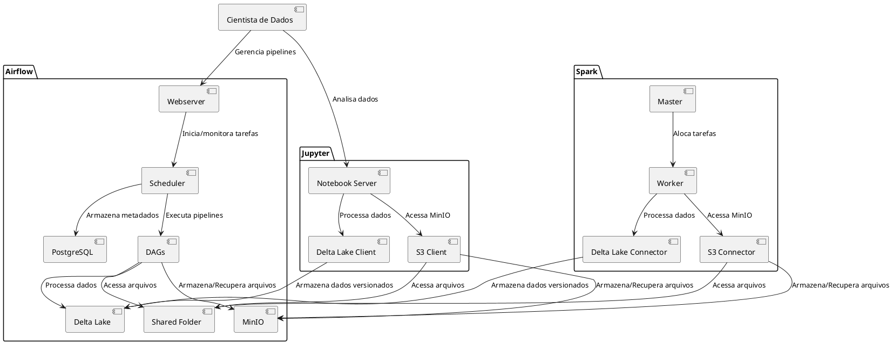

# Documentação C4: Ambiente de Desenvolvimento para Ciência de Dados

Este documento descreve a arquitetura do ambiente de desenvolvimento para ciência de dados utilizando o modelo C4 (Contexto, Contêiner, Componente, Código). O sistema integra ferramentas containerizadas via Docker Compose para suportar armazenamento, processamento, orquestração, mensagens e análise de dados.

## 1. Diagrama de Contexto (Nível 1)

### Descrição
O **Ambiente de Desenvolvimento para Ciência de Dados** é um sistema local que fornece uma plataforma integrada para cientistas de dados realizarem ingestão, processamento, orquestração e análise de dados. Usuários interagem com interfaces web (Airflow, Jupyter, PgAdmin, Kafka UI, MinIO) e APIs (Kafka, MinIO) para gerenciar pipelines, armazenar dados e realizar análises.

### Diagrama
```plantuml
@startuml
!define RECTANGLE class

actor "Cientista de Dados" as User

RECTANGLE "Ambiente de Desenvolvimento para Ciência de Dados" as System {
  :APIs e Interfaces Web; --> [User] : Gerencia pipelines, analisa dados, armazena arquivos
}

@enduml
```

---

## 2. Diagrama de Contêiner (Nível 2)

### Descrição
O sistema é composto por contêineres Docker conectados via uma rede (`ds-network`). Cada contêiner executa uma ferramenta específica, com dados persistidos em um volume unificado (`./data`) e conexões seguras gerenciadas por credenciais no arquivo `.env`.

### Contêineres
- **PostgreSQL**: Banco relacional para metadados e dados estruturados.
- **PgAdmin**: Interface web para gerenciamento do PostgreSQL.
- **Airflow**: Orquestrador de pipelines, acessando PostgreSQL e MinIO.
- **Spark Master/Worker**: Framework de computação distribuída, integrado com MinIO e Delta Lake.
- **Spark History Server**: Armazena logs de jobs Spark.
- **Kafka**: Plataforma de streaming para ingestão de dados.
- **Zookeeper**: Coordenação para Kafka.
- **Kafka UI**: Interface web para monitoramento do Kafka.
- **Jupyter**: Ambiente interativo para análise em Python/R, integrado com MinIO e Delta Lake.
- **MinIO**: Armazenamento S3-compatível para arquivos compartilhados e backups.

### Diagrama
```plantuml
@startuml
!define RECTANGLE class

actor "Cientista de Dados" as User

package "Ambiente de Desenvolvimento para Ciência de Dados" {
  [PostgreSQL] #--> [PgAdmin] : Gerenciamento via web
  [PostgreSQL] #--> [Airflow] : Armazena metadados
  [Airflow] #--> [MinIO] : Armazena/Recupera arquivos via S3
  [Airflow] #--> [Shared Folder] : Acessa arquivos compartilhados
  [Airflow] #--> [Delta Lake] : Processa dados versionados
  [Spark Master] #--> [Spark Worker] : Gerencia jobs
  [Spark Master] #--> [MinIO] : Armazena/Recupera arquivos via S3
  [Spark Master] #--> [Shared Folder] : Acessa arquivos compartilhados
  [Spark Master] #--> [Delta Lake] : Processa dados versionados
  [Spark Worker] #--> [MinIO] : Armazena/Recupera arquivos via S3
  [Spark Worker] #--> [Shared Folder] : Acessa arquivos compartilhados
  [Spark Worker] #--> [Delta Lake] : Processa dados versionados
  [Spark History] #--> [Spark Master] : Acessa logs
  [Kafka] #--> [Zookeeper] : Coordenação
  [Kafka UI] #--> [Kafka] : Monitoramento via web
  [Kafka UI] #--> [Zookeeper] : Acessa metadados
  [Jupyter] #--> [MinIO] : Armazena/Recupera arquivos via S3
  [Jupyter] #--> [Shared Folder] : Acessa arquivos compartilhados
  [Jupyter] #--> [Delta Lake] : Processa dados versionados
  [MinIO] : Armazenamento S3
  [Shared Folder] : Pasta compartilhada
  [Delta Lake] : Dados versionados (Bronze, Silver, Gold)
}

User --> [PgAdmin] : Gerencia banco
User --> [Airflow] : Orquestra pipelines
User --> [Kafka UI] : Monitora streaming
User --> [Jupyter] : Analisa dados
User --> [MinIO] : Gerencia armazenamento
User --> [Spark Master] : Monitora jobs

@enduml
```

---

## 3. Diagrama de Componente (Nível 3)

### Descrição
Este nível detalha componentes internos de contêineres críticos: Airflow, Spark, e Jupyter. Esses contêineres são centrais para orquestração, processamento e análise de dados.

### Componentes
- **Airflow**:
  - **Webserver**: Interface web para gerenciar DAGs.
  - **Scheduler**: Agenda e executa tarefas.
  - **Metadados**: Armazenados no PostgreSQL.
  - **DAGs**: Pipelines definidos em `./data/airflow/dags`.
- **Spark**:
  - **Master**: Gerencia cluster e aloca tarefas.
  - **Worker**: Executa jobs distribuídos.
  - **Delta Lake Connector**: Integra com `./data/delta_lake` para dados versionados.
  - **S3 Connector**: Acessa MinIO via S3 API.
- **Jupyter**:
  - **Notebook Server**: Interface para notebooks Python/R.
  - **Delta Lake Client**: Processa dados em `./data/delta_lake`.
  - **S3 Client**: Acessa MinIO via S3 API.

### Diagrama


---

## 4. Diagrama de Código (Nível 4)

### Observação
O nível de código (e.g., classes, métodos) não é detalhado, pois o sistema é baseado em ferramentas de infraestrutura (Docker, Airflow, Spark, etc.) sem desenvolvimento de código personalizado em nível de classes. Os exemplos de código no `README.md` (artifact ID: `1f7812b6-cb26-4837-877a-54116d6d6652`) ilustram interações com Airflow DAGs, Spark/Delta Lake, e MinIO.

---

## Configuração e Integração

- **Persistência**: Todos os contêineres utilizam um volume unificado (`./data`) com subdiretórios para dados específicos (e.g., `./data/postgres`, `./data/delta_lake`).
- **Segurança**: Credenciais são gerenciadas no arquivo `.env` (e.g., `MINIO_ROOT_USER`, `POSTGRES_PASSWORD`), garantindo conexões seguras ao MinIO e PostgreSQL.
- **Rede**: A rede `ds-network` permite comunicação entre contêineres via nomes de serviço (e.g., `minio:9000`).
- **Delta Lake**: Suporta a arquitetura medalhão (Bronze, Silver, Gold) em `./data/delta_lake`, com versionamento via Spark e Jupyter.
- **MinIO**: Fornece armazenamento S3-compatível, acessado por Airflow, Spark, e Jupyter com credenciais seguras.

---

## Instruções de Uso
Consulte o `README.md` (artifact ID: `1f7812b6-cb26-4837-877a-54116d6d6652`) para detalhes sobre instalação, uso e solução de problemas.

---

<div align="center">
    <h3>Desenvolvido por Mauricio A. Almeida</h3>
    <a href="https://github.com/mauricioaalmeida"></a>
    <a href="https://linkedin.com/in/mauricioaalmeida"></a>
</div>